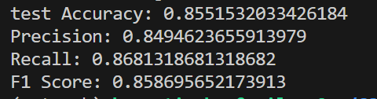

# CS3307

CS3307 课程大作业：情感分析

## 数据处理

两个csv数据文件保存在data文件夹下

数据处理见get_preprocessd_data.py其调用utils.py中的preprocess进行数据清洗工作，得到的进一步数据也存储在data文件夹下。

## 训练过程介绍

### sklearn简单的词频+svm分类实现（CPU训练）

代码见 frequency_svm.py
训练集和验证集 9：1划分，迭代1000轮
验证集准确率：0.7818
测试集准确率：0.8106

### 预处理 + sklearn提供的多种模型实现

代码见 traditional_model.py

### WordAVGModel && RNN

具体模型代码见models.py 准确率也都在80％多
训练的代码为TrochText_train.py

### BERT（GPU训练）

代码见 BERT_train.py
模型参数文件在models文件夹下， 从[distilbert-base-uncased](https://huggingface.co/distilbert-base-uncased)处下载
目前取0.1％的数据作为训练集训练得到准确率为 80% 左右。

目前最高准确率为0.855

### 代码文件介绍

- data文件夹：用于存储数据文件，包括原始数据，经过简单处理的训练集测试及数据，经过复杂处理的训练集测试集数据（文件较大，可以自己生成）
- models文件夹： 用于存储BERT模型相关的原始权重
- results文件夹：用于存储结果和训练好的网络权重
- BERT_train.py: BERT模型的训练代码
- datasets.py: 生成dataloader
- frequency_svm.py: sklearn简单的词频+svm分类实现代码
- get_preprocessed_data.py: 对数据进行预处理的代码
- models.py: WordAVGModel && RNN模型代码
- PCA.py: 用于PCA分析的代码
- T-SNE: 用于对结果进行T-SNE分析的代码
- TorchText_train.py: WordAVGModel && RNN模型训练代码
- traditional_model.py: 预处理 + sklearn提供的多种模型实现
- train.py: 用于pytorch训练的一些工具代码
- utils.py: 用于数据处理等一些的工具代码

## 最终准确率实现实验过程

### 数据预处理

1. 将csv数据文件保存在data文件夹下
2. 运行 get_preprocessd_data.py 在data文件夹下 生成train_easy_processed.csv 和test_easy_processed.csv（通过修改 get_preprocessd_data.py 和utils.py中的文件路径使得train变为test）

### 模型训练

1. 将 BERT_train.py line44 的load_path参数置为空，然后运行 BERT_train.py，其中出现路径的地方需要自己创建空文件夹。

### 模型可视化

1. 将BERT_train.py line47 的save_results() 函数取消注释。该函数可以在results文件夹下生成中间层的向量，然后调用PCA.py  或T-SNE.py可以对中间层进行可视化分析。
