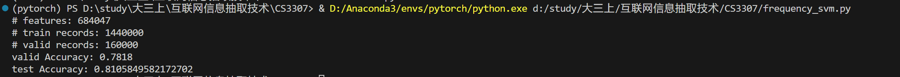

# CS3307

CS3307 课程大作业：情感分析

## 数据处理

两个csv数据文件保存在data文件夹下

## sklearn简单的词频+svm分类实现（CPU训练）

代码见 frequency_svm.py
训练集和验证集 9：1划分，迭代1000轮
验证集准确率：0.7818
测试集准确率：0.8106

## Transformers Teacher蒸馏模型（GPU训练）

代码见 Trans_Teacher.py
模型参数文件在models文件夹下， 从[distilbert-base-uncased](https://huggingface.co/distilbert-base-uncased)处下载
目前取0.1％的数据作为训练集训练得到准确率为 80% 左右。 